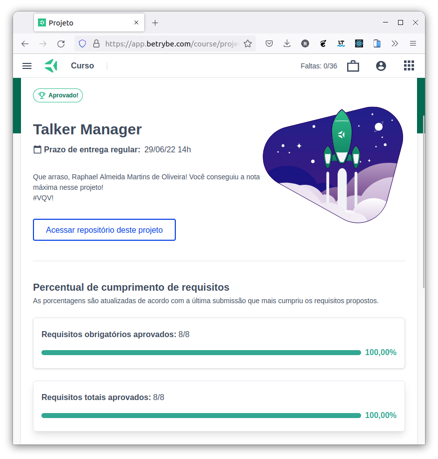

# :shopping_cart: Store Manager :shopping_bags:

## :page_with_curl: About/Sobre

  
<strong>:us: English</strong>
 

Node.js and Express.js project developed by [Raphael Martins](https://www.linkedin.com/in/raphaelameidamartins/) at the end of Unit 23 ([Back-end Development Module](https://github.com/raphaelalmeidamartins/trybe_exercicios/tree/main/3_Desenvolvimento-Back-end)) of Trybe's Web Development course. I was approved with 100% of the mandatory and optional requirements met.

We had to create a RESTful API using MSC (Model-Service-Controller) architecture and implement unit tests with Mocha, Chai and Sinon.
 

  
<strong>:brazil: Português</strong>
 

Projeto Node.js e Express.js desenvolvido por [Raphael Martins](https://www.linkedin.com/in/raphaelameidamartins/) ao final do Bloco 19 ([Módulo Desenvolvimento Back-end](https://github.com/raphaelalmeidamartins/trybe_exercicios/tree/main/3_Desenvolvimento-Back-end)) do curso de Desenvolvimento Web da Trybe. Fui aprovado com 100% dos requisitos obrigatórios e opcionais atingidos.

Tivemos que criar uma API RESTful usando a arquitetura MSC (Model-Service-Controller) e implementar testes unitários com Mocha, Chai e Sinon.
 

## :man_technologist: Developed Skills/Habilidades Desenvolvidas

  
<strong>:us: English</strong>
 

* Create a Express.js application
* Create a RESTful API using MSC (Model-Service-Controller) architecture
* Validate requests' data with the Joi library
* Implement unit tests with Mocha, Chai and Sinon
 

  
<strong>:brazil: Português</strong>
 

* Criar uma aplicação Express.js
* Criar uma API RESTful usando arquitetura MSC (Model-Service-Controller)
* Validar dados das requisições com a biblioteca Joi
* Implementar testes unitários com Mocha, Chai e Sinon
 

## :hammer_and_wrench: Tools/Ferramentas

* Node.js
* Express.js
* Express Rescue
* Body Parser
* DotEnv
* Joi
* Mocha.js
* Chai.js
* Sinon.js
* Docker
* MySQL

## :trophy: Grade/Nota

