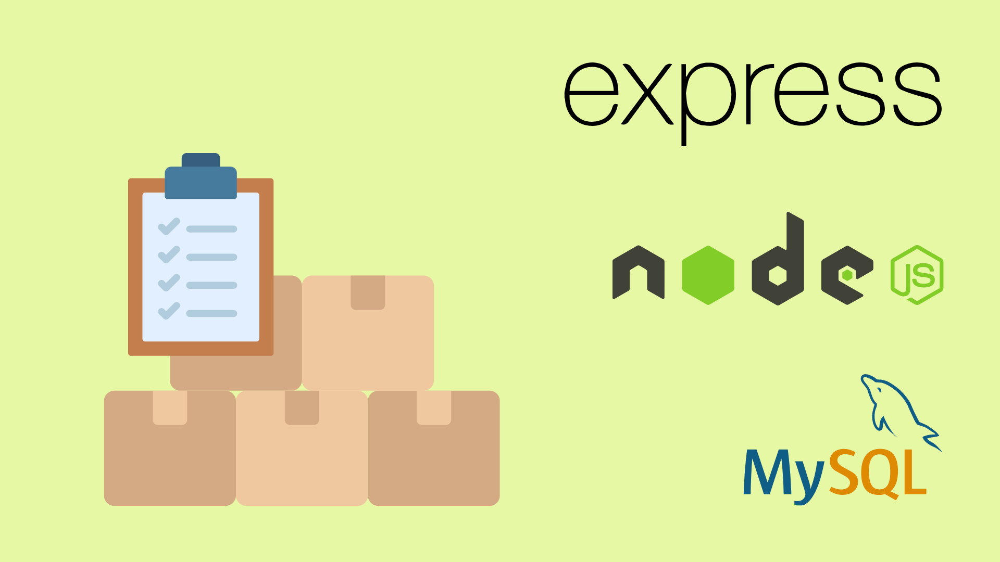

# :shopping_cart: Store Manager :department_store:



## :page_with_curl: About/Sobre

<details>
  <summary markdown="span"><strong>:us: English</strong></summary><br />

Node.js and Express.js project developed by [Raphael Martins](https://www.linkedin.com/in/raphaelameidamartins/) at the end of Unit 23 ([Back-end Development Module](https://github.com/raphaelalmeidamartins/trybe_exercicios/tree/main/3_Desenvolvimento-Back-end)) of Trybe's Web Development course. I was approved with 100% of the mandatory and optional requirements met.

We had to create a RESTful API using MSC (Model-Service-Controller) architecture and implement unit tests with Mocha, Chai and Sinon.
<br />
</details>

<details>
  <summary markdown="span"><strong>:brazil: Português</strong></summary><br />

Projeto Node.js e Express.js desenvolvido por [Raphael Martins](https://www.linkedin.com/in/raphaelameidamartins/) ao final do Bloco 23 ([Módulo Desenvolvimento Back-end](https://github.com/raphaelalmeidamartins/trybe_exercicios/tree/main/3_Desenvolvimento-Back-end)) do curso de Desenvolvimento Web da Trybe. Fui aprovado com 100% dos requisitos obrigatórios e opcionais atingidos.

Tivemos que criar uma API RESTful usando a arquitetura MSC (Model-Service-Controller) e implementar testes unitários com Mocha, Chai e Sinon.
<br />
</details>

## :man_technologist: Developed Skills/Habilidades Desenvolvidas

<details>
  <summary markdown="span"><strong>:us: English</strong></summary><br />

* Create an Express.js application
* Create a RESTful API using MSC (Model-Service-Controller) architecture
* Validate requests' data with the Joi library
* Implement unit tests with Mocha, Chai and Sinon
<br />
</details>

<details>
  <summary markdown="span"><strong>:brazil: Português</strong></summary><br />

* Criar uma aplicação Express.js
* Criar uma API RESTful usando arquitetura MSC (Model-Service-Controller)
* Validar dados das requisições com a biblioteca Joi
* Implementar testes unitários com Mocha, Chai e Sinon
<br />
</details>

## :hammer_and_wrench: Tools/Ferramentas

* Node.js
* Express.js
* Express Rescue
* DotEnv
* Joi
* Mocha.js
* Chai.js
* Sinon.js
* Docker
* MySQL

## :hammer_and_wrench: Installation and execution/Instalação e execução

<details>
  <summary markdown="span"><strong>:us: English</strong></summary><br />

To run this application you need to have **Git**, **Docker** and **Docker Compose** installed on your machine. Docker Compose needs to be at **1.29** version or superior.

### 1 - Clone the repository
```sh
git clone git@github.com:raphaelalmeidamartins/store-manager.git
```

### 2 - Run the containers by running the command below in the application folder
```sh
docker-compose up -d --buid
```

### 3 - Run this command to attach the container to your terminal
```sh
docker exec -it store_manager bash
```

### 4 - On the attached container, install the dependencies and run the application

Install the dependencies:
```sh
npm install
```

Run the application:
```sh
npm start
```

### 5 - Access the documentation and make requests to the server running on the port 3000

Access the route http://localhost:3000/docs/en to see the English documentation and try the API. If you prefer, you can use a HTTP requests client of your choice (Insomnia, Thunder Client, etc) to make requests.

### 6 - Check the tests coverage by running the following command on the attached terminal
```sh
npm run test:mocha
```
<br />
</details>

<details>
  <summary markdown="span"><strong>:brazil: Português</strong></summary><br />

Para rodar está aplicação é necessário ter **Git**, **Docker** e o **Docker Compose** instalados no seu computador. O Docker Compose precisa estar na versão **1.29** ou superior.

### 1 - Clone o repositório
```sh
git clone git@github.com:raphaelalmeidamartins/store-manager.git
```

### 2 - Rode os containers executando o comando abaixo na pasta raiz da aplicação
```sh
docker-compose up -d --build
```

### 3 - Rode o comando para abrir o terminal do container store_manager
```sh
docker exec -it store_manager bash
```

### 4 - No terminal do container, installe as dependências e execute a aplicação

Instalando dependências:
```sh
npm install
```

Executando aplicação:
```sh
npm start
```

### 5 - Acesse a documentação e faça requisições para o servidor aberto na porta 3000

Acesse a rota http://localhost:3000/docs/br para acessar a documentação em português e testar a API. Se preferir, utilize um cliente de requisições HTTP de sua preferência (Insomnia, Thunder Client, etc) para fazer as requisições.

### 6 - Rode o seguinte comando no terminal do container para verificar a cobertura dos testes
```sh
npm run test:mocha
```
<br />
</details>

## :books: Documentation/Documentação

<details>
  <summary markdown="span"><strong>:us: English</strong></summary><br />

With the application running, enter the http://localhost:3000/docs/en route on your browser to see the English documentation.
<br />
</details>

<details>
  <summary markdown="span"><strong>:brazil: Português</strong></summary><br />

Com a aplicação em execução, acesse a rota http://localhost:3000/docs/br no navegador para ver a documentação em português.
<br />
</details>

## :test_tube: Tests Coverage/Cobertura de Testes


## :trophy: Grade/Nota


